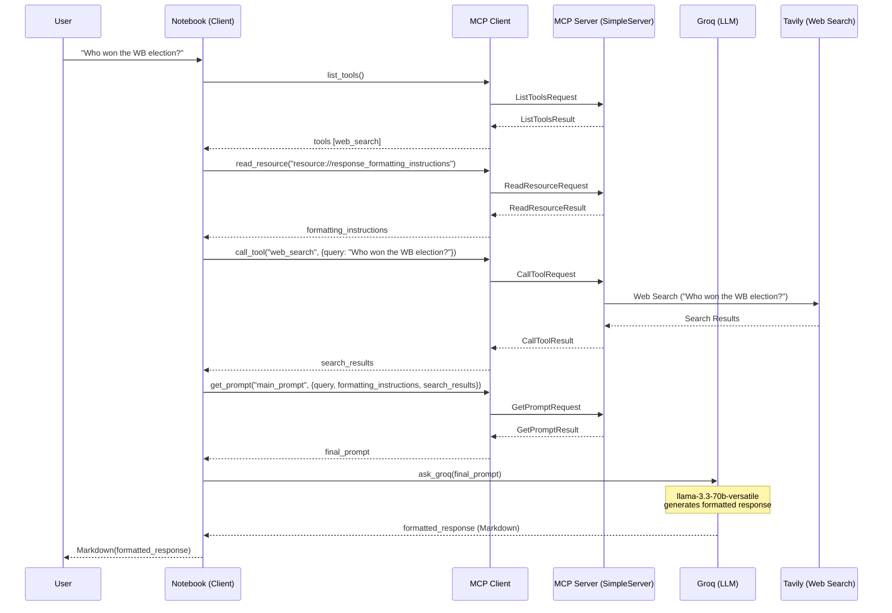

```mermaid
sequenceDiagram
    participant User
    participant Notebook as Notebook (Client)
    participant MCPClient as MCP Client
    participant MCPServer as MCP Server (SimpleServer)
    participant Groq as Groq (LLM)
    participant Tavily as Tavily (Web Search)

    User->>Notebook: "Who won the WB election?"

    Notebook->>MCPClient: list_tools()
    MCPClient->>MCPServer: ListToolsRequest
    MCPServer-->>MCPClient: ListToolsResult
    MCPClient-->>Notebook: tools [web_search]

    Notebook->>MCPClient: read_resource("resource://response_formatting_instructions")
    MCPClient->>MCPServer: ReadResourceRequest
    MCPServer-->>MCPClient: ReadResourceResult
    MCPClient-->>Notebook: formatting_instructions

    Notebook->>MCPClient: call_tool("web_search", {query: "Who won the WB election?"})
    MCPClient->>MCPServer: CallToolRequest
    MCPServer->>Tavily: Web Search ("Who won the WB election?")
    Tavily-->>MCPServer: Search Results
    MCPServer-->>MCPClient: CallToolResult
    MCPClient-->>Notebook: search_results

    Notebook->>MCPClient: get_prompt("main_prompt", {query, formatting_instructions, search_results})
    MCPClient->>MCPServer: GetPromptRequest
    MCPServer-->>MCPClient: GetPromptResult
    MCPClient-->>Notebook: final_prompt

    Notebook->>Groq: ask_groq(final_prompt)
    Note over Groq: llama-3.3-70b-versatile<br/>generates formatted response
    Groq-->>Notebook: formatted_response (Markdown)
    Notebook-->>User: Markdown(formatted_response)
```
