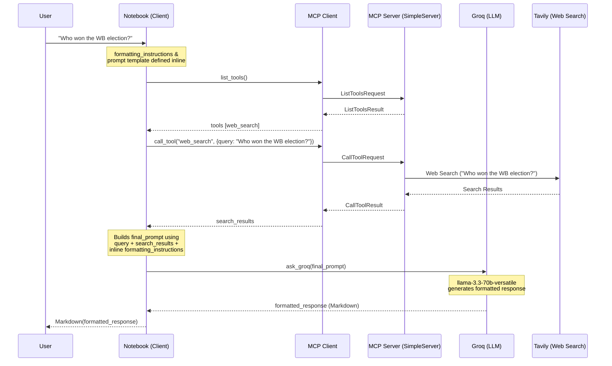

```mermaid
sequenceDiagram
    participant User
    participant Notebook as Notebook (Client)
    participant MCPClient as MCP Client
    participant MCPServer as MCP Server (SimpleServer)
    participant Groq as Groq (LLM)
    participant Tavily as Tavily (Web Search)

    User->>Notebook: "Who won the WB election?"
    Note over Notebook: formatting_instructions &<br/>prompt template defined inline

    Notebook->>MCPClient: list_tools()
    MCPClient->>MCPServer: ListToolsRequest
    MCPServer-->>MCPClient: ListToolsResult
    MCPClient-->>Notebook: tools [web_search]

    Notebook->>MCPClient: call_tool("web_search", {query: "Who won the WB election?"})
    MCPClient->>MCPServer: CallToolRequest
    MCPServer->>Tavily: Web Search ("Who won the WB election?")
    Tavily-->>MCPServer: Search Results
    MCPServer-->>MCPClient: CallToolResult
    MCPClient-->>Notebook: search_results

    Note over Notebook: Builds final_prompt using<br/>query + search_results +<br/>inline formatting_instructions

    Notebook->>Groq: ask_groq(final_prompt)
    Note over Groq: llama-3.3-70b-versatile<br/>generates formatted response
    Groq-->>Notebook: formatted_response (Markdown)
    Notebook-->>User: Markdown(formatted_response)
```
