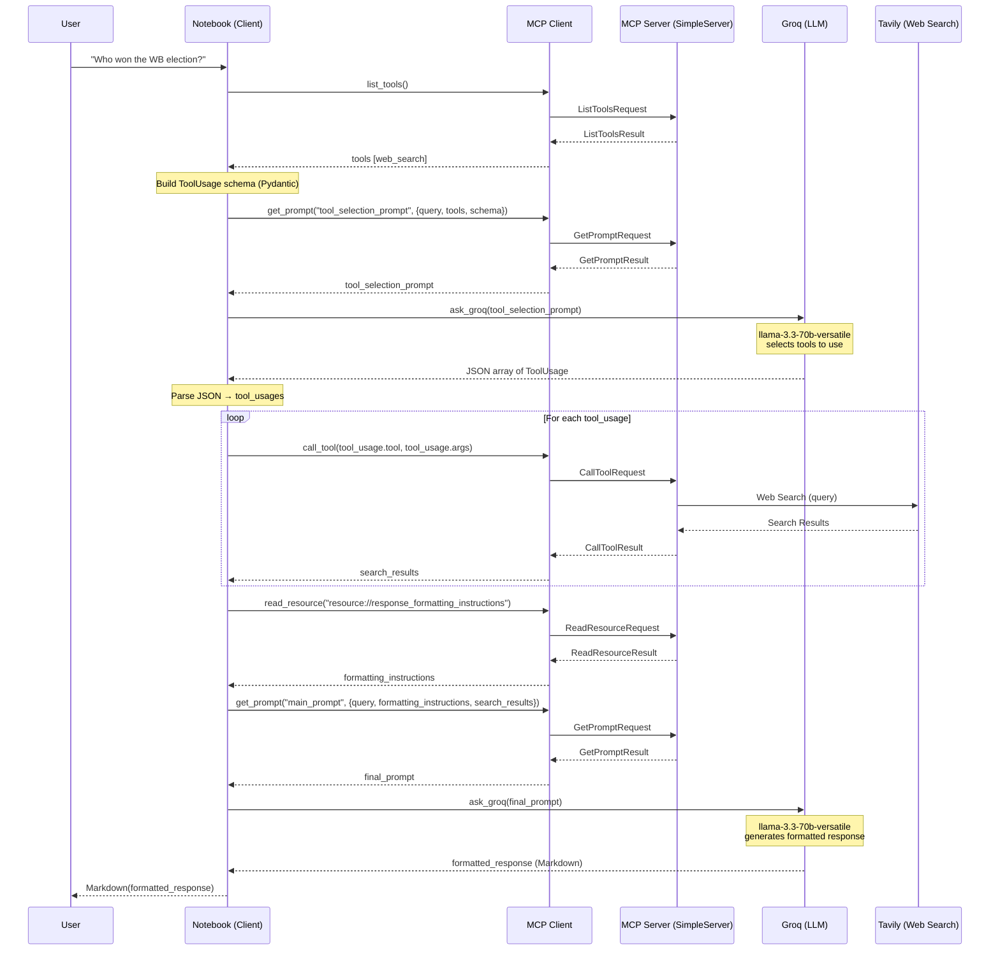

```mermaid
sequenceDiagram
    participant User
    participant Notebook as Notebook (Client)
    participant MCPClient as MCP Client
    participant MCPServer as MCP Server (SimpleServer)
    participant Groq as Groq (LLM)
    participant Tavily as Tavily (Web Search)

    User->>Notebook: "Who won the WB election?"

    Notebook->>MCPClient: list_tools()
    MCPClient->>MCPServer: ListToolsRequest
    MCPServer-->>MCPClient: ListToolsResult
    MCPClient-->>Notebook: tools [web_search]

    Note over Notebook: Build ToolUsage schema (Pydantic)

    Notebook->>MCPClient: get_prompt("tool_selection_prompt", {query, tools, schema})
    MCPClient->>MCPServer: GetPromptRequest
    MCPServer-->>MCPClient: GetPromptResult
    MCPClient-->>Notebook: tool_selection_prompt

    Notebook->>Groq: ask_groq(tool_selection_prompt)
    Note over Groq: llama-3.3-70b-versatile<br/>selects tools to use
    Groq-->>Notebook: JSON array of ToolUsage

    Note over Notebook: Parse JSON → tool_usages

    loop For each tool_usage
        Notebook->>MCPClient: call_tool(tool_usage.tool, tool_usage.args)
        MCPClient->>MCPServer: CallToolRequest
        MCPServer->>Tavily: Web Search (query)
        Tavily-->>MCPServer: Search Results
        MCPServer-->>MCPClient: CallToolResult
        MCPClient-->>Notebook: search_results
    end

    Notebook->>MCPClient: read_resource("resource://response_formatting_instructions")
    MCPClient->>MCPServer: ReadResourceRequest
    MCPServer-->>MCPClient: ReadResourceResult
    MCPClient-->>Notebook: formatting_instructions

    Notebook->>MCPClient: get_prompt("main_prompt", {query, formatting_instructions, search_results})
    MCPClient->>MCPServer: GetPromptRequest
    MCPServer-->>MCPClient: GetPromptResult
    MCPClient-->>Notebook: final_prompt

    Notebook->>Groq: ask_groq(final_prompt)
    Note over Groq: llama-3.3-70b-versatile<br/>generates formatted response
    Groq-->>Notebook: formatted_response (Markdown)
    Notebook-->>User: Markdown(formatted_response)
```
